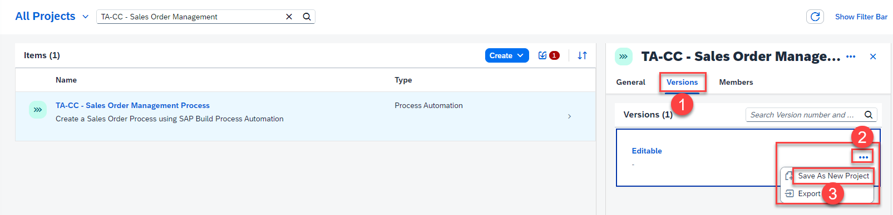

In this lesson you will create a process from the project template.

1. Select **[Lobby]({link|buildlobby})** to open the entry page of **SAP Build** Process Automation.

   

2. In the **Lobby**, search for **TA-CC - Sales Order Management**. 

3. Once you have found the process template, open the navigation menu of the Build Automation Project.

   

4. In the **navigate** menu, open the **Versions** tab.

5. In the **Editable** section, select the three dots **(•••)** and choose **Save As New Project**.

   

6. On the next screen, enter the following details:

   > **IMPORTANT**: Do not forget to **remove** the template name **TA-CC** in front of the Project Name.

    | Input Field | Input Value    |
    | ----------- | -------------- |
    | Project Name   | **Sales Orders Management {placeholder\|userid}** |
    | Description    | **Sales Orders Management Project of {placeholder\|userid}**|

7. Select **Save As New**.

   

   > **Note:** Make sure to use the provided naming conventions. Otherwise, you will encounter issues later on in the exercise.

8. If prompted, select **Accept** to proceed.

   
