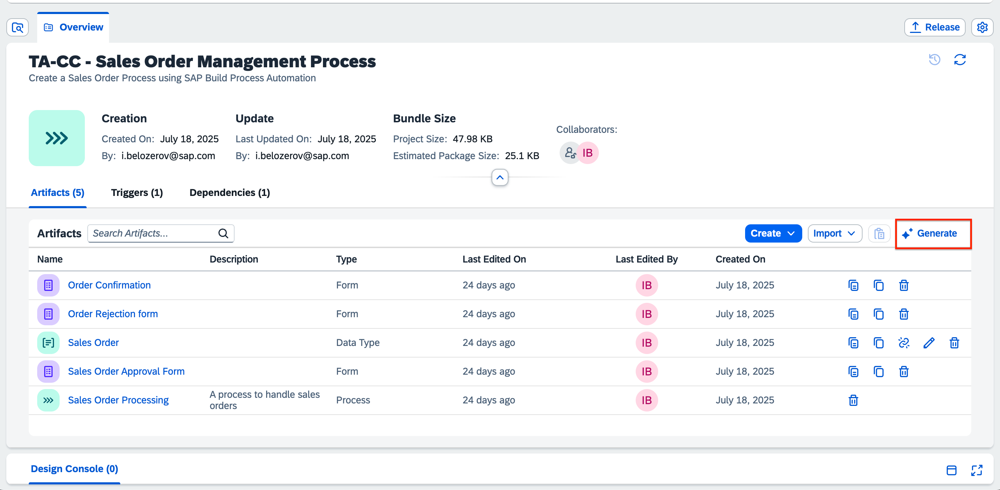
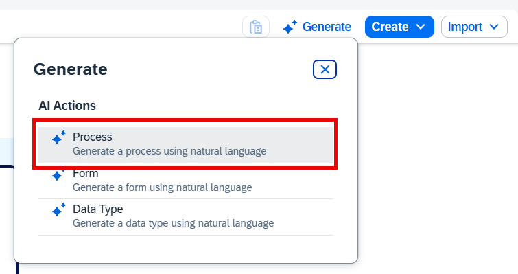
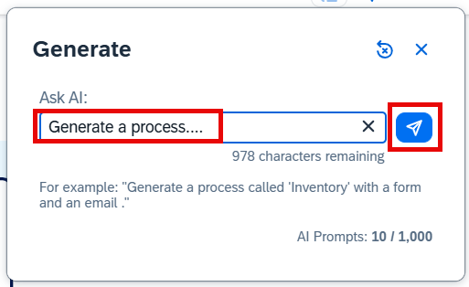
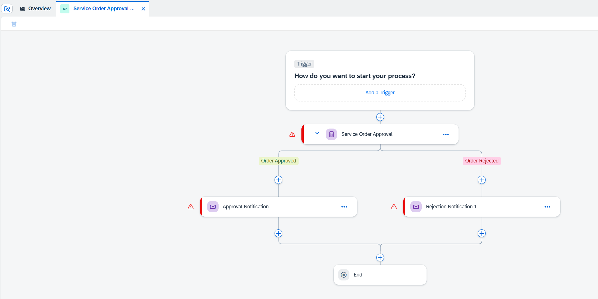
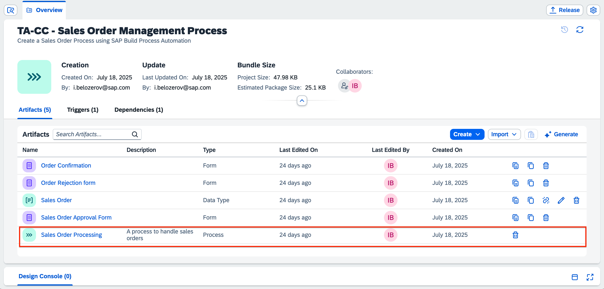

In this lesson, you will learn to generate process using Joule. 

1. In the Overview tab of your process, choose **Generate**.

    

2. In the popup choose **Process**.

    

3. Paste the following prompt to the **Ask AI** field and the choose **Send** button.

    ~~~
    Generate a process for service order approval. The user should be notified with the forms if the order is approved or rejected.
    ~~~

    

4. After some time a new process will be generated. It will look something like this:

    
   
 After the process is generated, you will need to configure the fields manually. To save time and maintain uniformity for this tutorial, this template already has a process created and configured. Go back to the Overview tab and select **Sales Order Processing**.  
 

