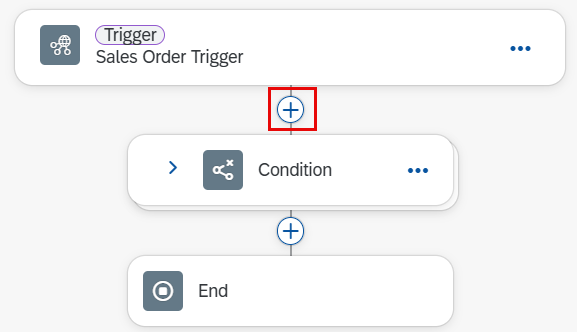

In this lesson, you will use the **ATP_Check** Action Project, which is already available in the lobby. This project leverages a service developed using **ABAP** to validate the availability of a requested material in the specified quantity. The service checks inventory and supply data and provides a response confirming whether the requested quantity can be fulfilled.

1. Open your **Sales Orders Management {placeholder\|userid}** project.

- Accept the **Disclaimer** if prompted.

2. Select the **Sales Order Processing** artifact.

   

   > The process begins with an API trigger, which will later be initiated by the application created using SAP Build Apps.

   

- In the following steps, we can check if the requested product is available in the specified quantity through an **Action** using a custom OData service developed in ABAP. 

3. As you see this process the first time, you probably want to know how it works. Choose **Generate** button and then choose **Explain this process**.

   

4. The explanation may look like on the screenshot below. For example you can see that the approval step is depending on the requested quantity. We want to change it: the approval should be started only if the requested material is available in the backend.

   

5. Select **(+)** icon after the trigger to add a step to the process.

   

6. Select **Action** followed by **Browse All Actions**.

   

7. In the Browse library page, find the Action project **Add new entity to ATPCheck** and select **Add**.

   

8. In the **General** tab, look for the Destination Variable and select **+ Create Destination Variable** in the drop down.

   

9. A dialog opens to create a destination variable. Enter **ATPCheck** in the field **Identifier** and then select **Create**.

   

10. Select the **Inputs** tab and configure the inputs section with the following fields

   | Form Input Fields    | Process Content Entry  |
   | -------------------- | ---------------------- |
   | Material             |  **material**          |
   | Quantity             |  **quantity**          |

   

11. Select the **Condition** operator in the process editor and select **Open Condition Editor** to modify the condition.

   

12. Change the branch condition value to:

   **OverallStatus**   -   **is equal to** -  **available**

13. **Apply** the changes.

      
