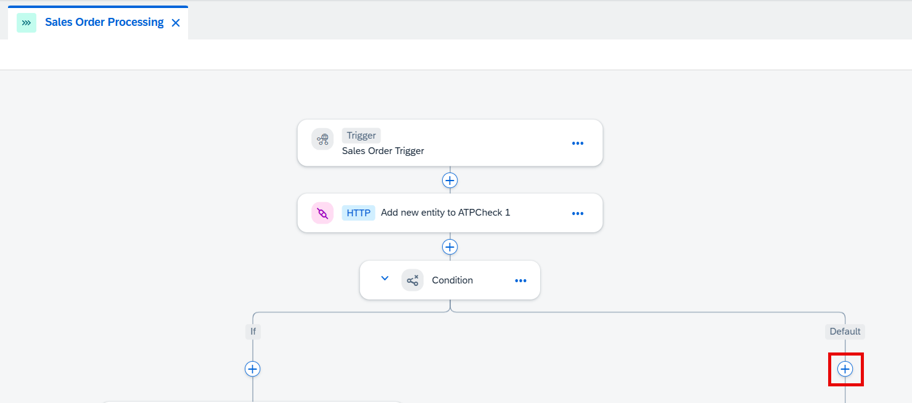
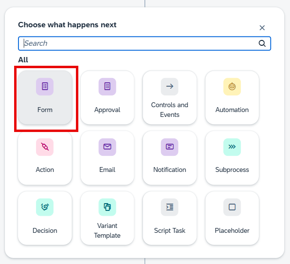
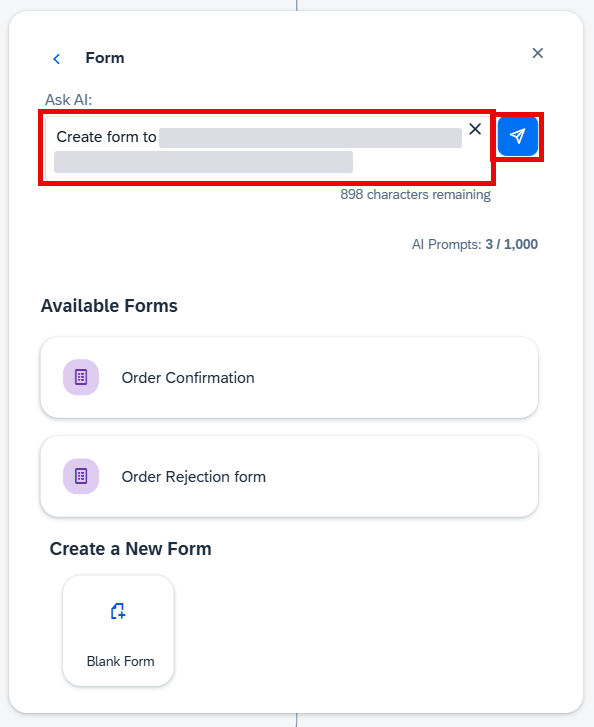
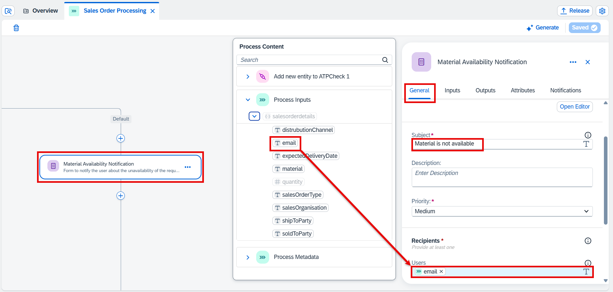
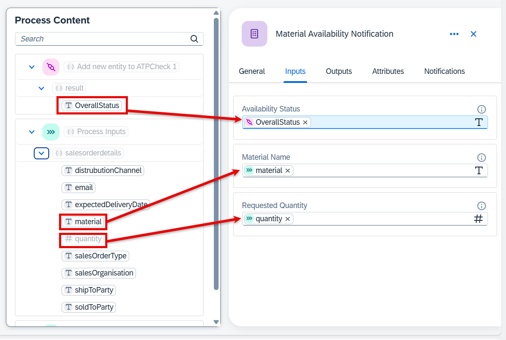
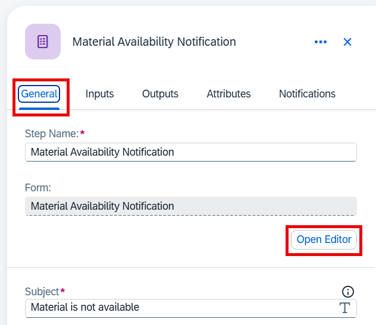
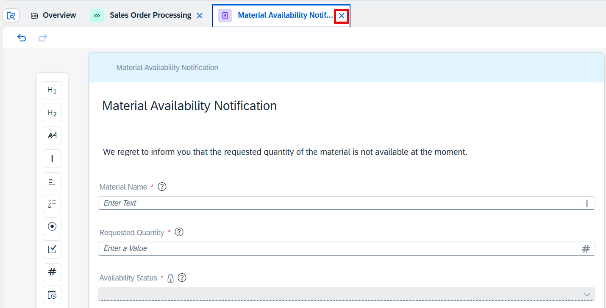
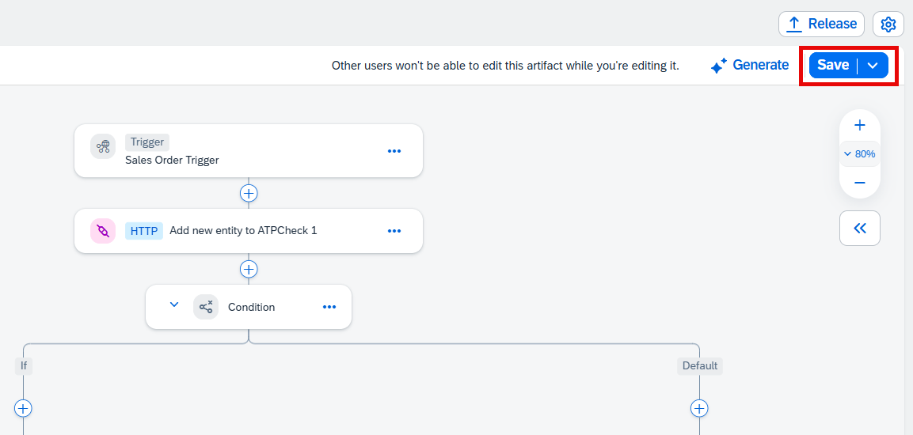

In this lesson, you will notify the user if the requested quantity is not available in the backend system.

1. Choose **+** on the **Default** branch of the condition.

     

2. Choose **Form**.

     

3. Paste the following prompt to the **Ask AI** field and then choose **Generate**.

    ~~~
    Create form that will notify the recepient that the requested material is not available with the requested quantity. The form should have the following inputs: availability status, material name, quantity.
    ~~~

    

4. Select the new form and go to **General** tab. Enter **Material is not available** in the **Subject** field. Then choose **Users** field and in the popup window select **Process Inputs** > **salesorderdetails** > **email**.

     

5. Select **Inputs** tab. Fill the following field with the following data:

    | Field                   | Data                                                               |
    | ----------------------- | ------------------------------------------------------------------ |
    | **Availability Status** | **Add new entity to ATPCheck 1** > **result** > **OverallStatus**  |
    | **Material Name**       | **Process Inputs** > **salesorderdetails** > **material**          |
    | **Quantity**            | **Process Inputs** > **salesorderdetails** > **quantity**          |
    
     

    > NOTE: your input fields can be different as you see in the tutorial. It's ok, as the AI can generate unexpected output. Just use the common sense when you map the fields (e.g. you can leave some fields empty).

6. Open **General** tab again. Then choose **Open Editor**.

     

7. You can see the layout of the notification form here. In the productive scenarios you would probably want to change something here. But for the tutorial leave it as is. You can close the tab with the editor.

     

8. **Save** your work.

    
