### Release business process project

To run the process you have to first release and then deploy the business process project.

To release a project, the process artifact should be complete without errors. The AI generated process maybe incomplete with some errors. In order to release the project, we will deleted the AI generated process.

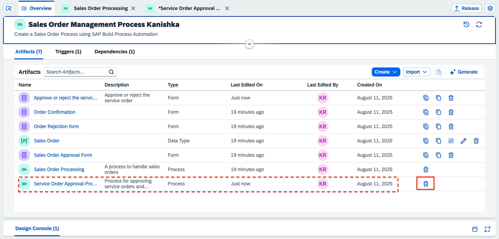

>Releasing a project creates a version or snapshot of the changes and deploying the project makes it available in runtime to be consumed. You can only deploy a released version of the project, and at a given time there can be multiple deployed versions of the same project.

1. In the Process Builder, to release a project, select the **Release** button on the top-right corner of the screen.

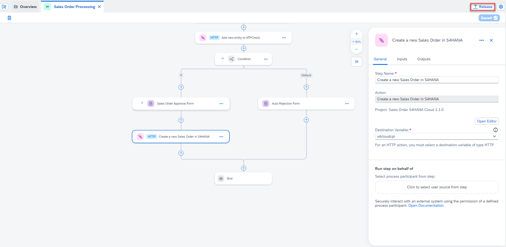

   - Every time you release, a new version will be created. The version is incremented automatically based on how you want to store the changes in the repository like major or minor update or just as a patch.

   - If you are releasing for the first time, then the version will start with **1.0.0**. Next time you release, the version numbers will be automatically updated.

2. Select **Release**.

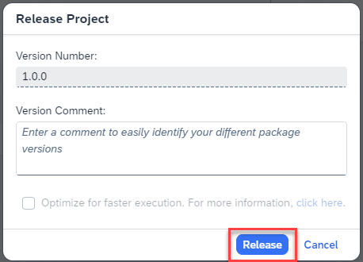

### Deploy the released project

1. Once the project is released successfully, open the **released** project version.

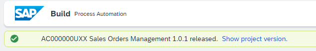

2. Select the **Deploy** button on the top-right corner of the screen.

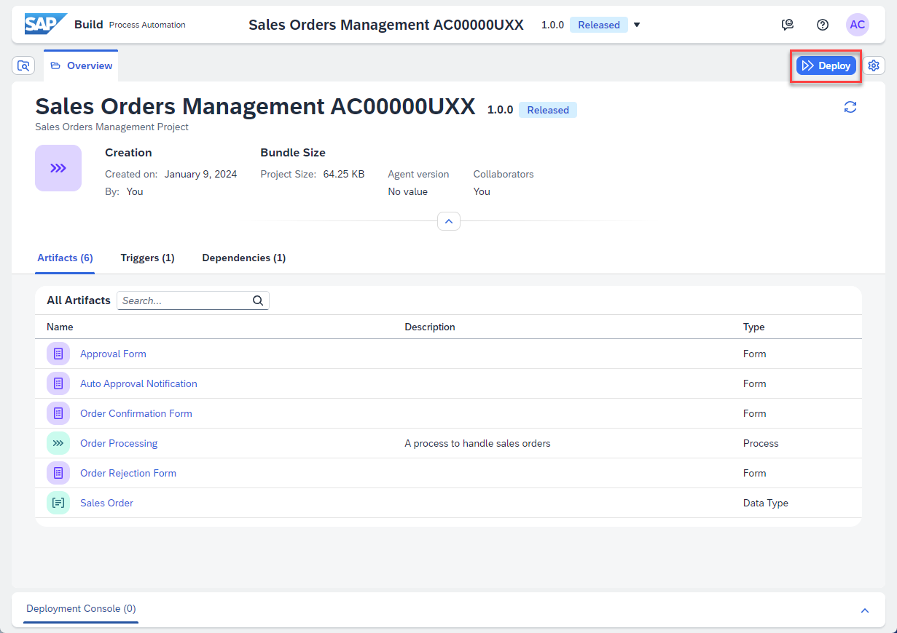

3. Select **Public** environment and select **Deploy**.

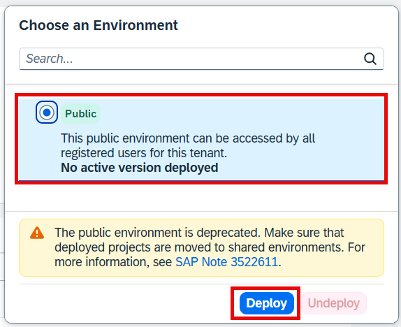

4. Select **Deploy**.

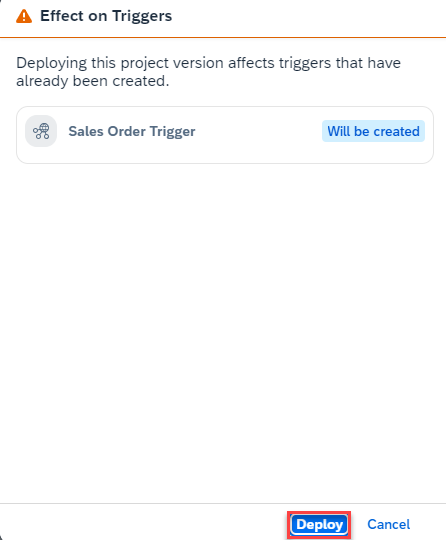

5. Select the following destinations:
   - **S4HANA_OData_ATPcheck** for the **ATPcheck** from the drop down.
   - **S4HANA_CLOUD_CPI** for the **s4cloudcpi** from the drop down.
   
6. Select **Deploy**.

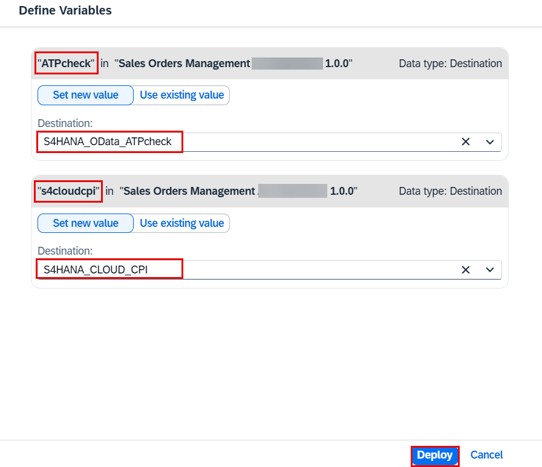

   > **S4HANA_CLOUD_CPI** refers to a BTP destination that leverages an SAP Integration Suite integration flow (iFlow) to post Sales Order data to the SAP S/4HANA Cloud tenant. The iFlow utilizes an OData ABAP API to manage the creation of Sales Orders in S/4HANA Cloud. This process aligns with the principles of a **Clean Core** approach, ensuring minimal customizations and preserving the standard capabilities of the S/4HANA Cloud system.
   
   > **S4HANA_ATPcheck**  refers to a BTP destination that connects to a custom service in SAP S/4HANA Cloud, developed using ABAP, to perform an ATP (Available-to-Promise) check. This service validates whether a requested material is available in the specified quantity by analyzing inventory and supply data. The solution aligns with the **Clean Core** approach by encapsulating custom logic within the ABAP environment, avoiding invasive modifications to the S/4HANA Cloud core functionalities.

7. Once the deployment is successful, you will see a changed status.

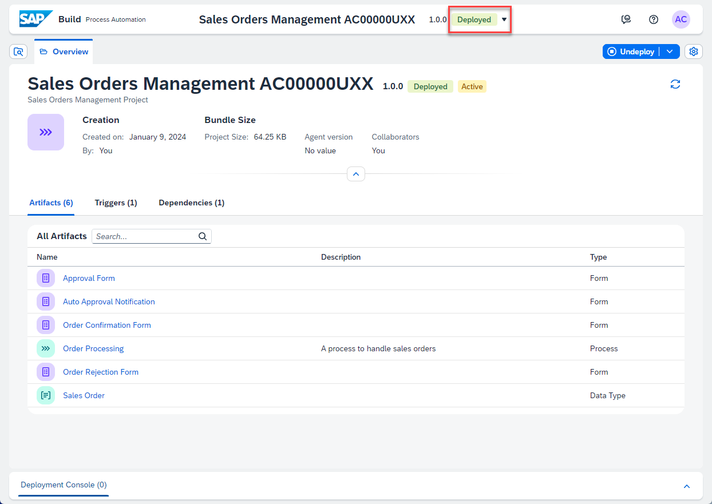

   > You cannot edit released or deployed projects. To continue working on your project, you need to select the Editable version of your project (at the top of the page).

### Publish to the SAP Build Library

1. After you released and deployed the process, go to SAP Build Lobby and find your project (for instance, **Sales Orders Management  {placeholder\|userid}**).

2. For your recently deployed version of the project, Select on the three dots under options and then, select **Publish to Library**.

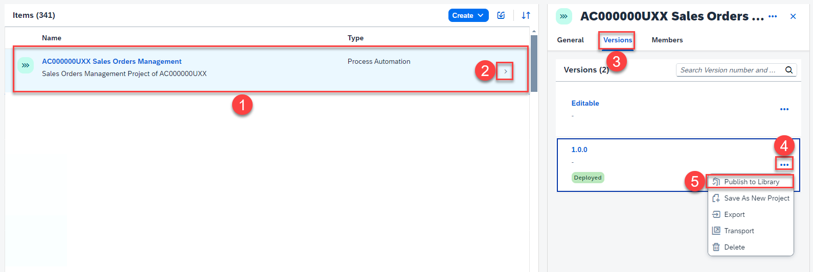

3. Select the recent version and choose Publish. Now your process will be visible from SAP Build Apps in SAP Build Library section..

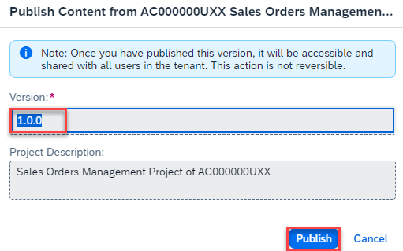
   
You have successfully released, deployed and published your process. It is time to run the process and see the results.

