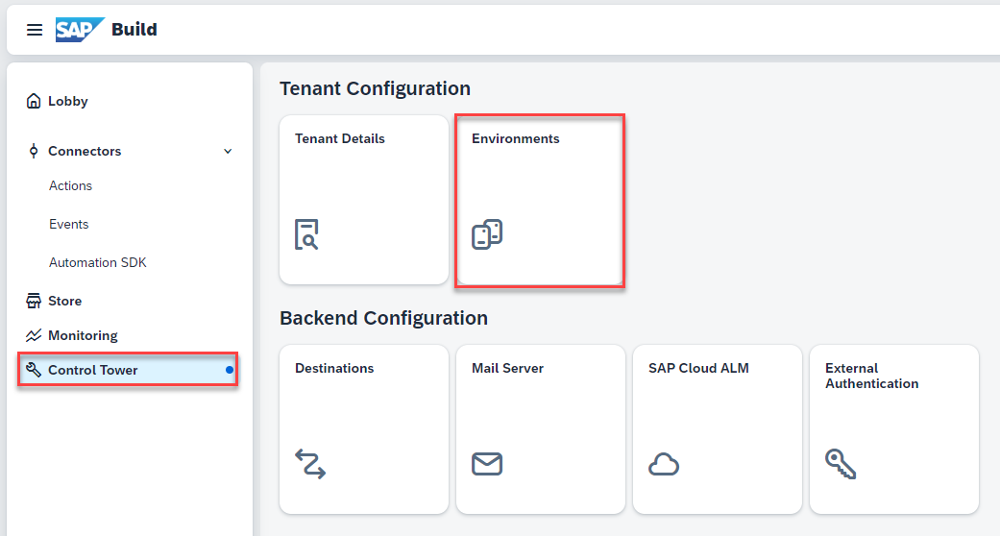
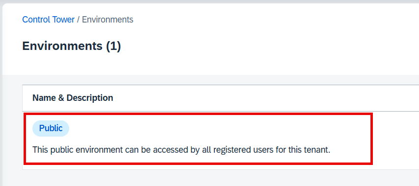
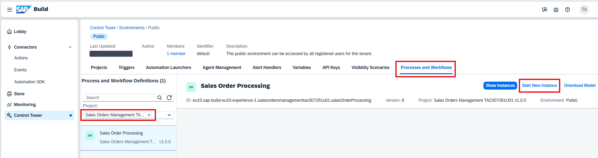
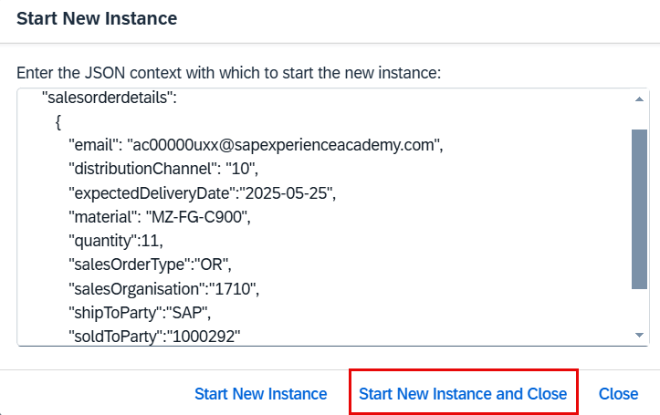

Let’s test the API Trigger.

1. From the SAP Build [Lobby]({link|buildlobby}), navigate to **Control Tower** > **Environments**.

   

2. Select the **Public** environment and open the **Process and Workflows** tab.

   

3. Search for **{placeholder|userid}** to display your project.

4. Select **Start New Instance**.



5. Remove the example payload in the dialog.
   Use the following JSON in the dialog.

   ```json
   {
      "salesorderdetails": 
         {
            "email": "{placeholder|userid_lc}@sapexperienceacademy.com",
            "distributionChannel": "10",
            "expectedDeliveryDate":"2025-05-25",
            "material": "MZ-FG-C900",
            "quantity":11,
            "salesOrderType":"OR",
            "salesOrganisation":"1710",
            "shipToParty":"SAP",
            "soldToParty":"1000292"
         }
   }
   ```

   > The quantity must be entered as a number (no quotes) and dates must be entered in the preceding format for the expected delivery date.

6. Select **Start New Instance and Close**.

   

You have successfully run your project. It is time to monitor the process flow and access the tasks.