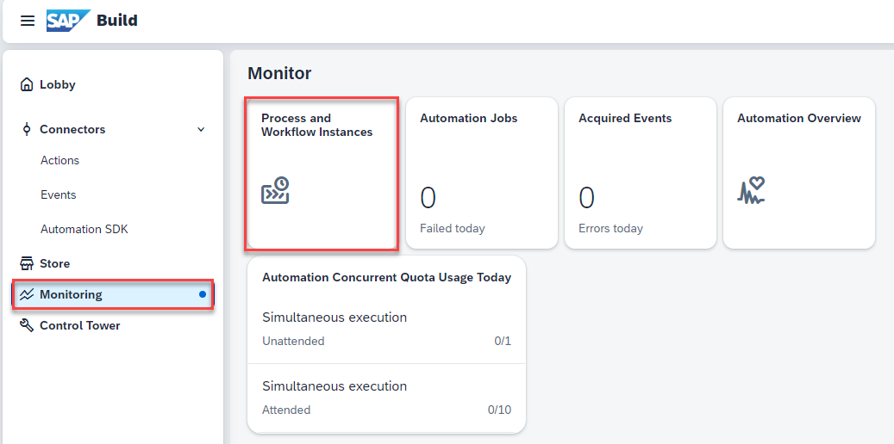
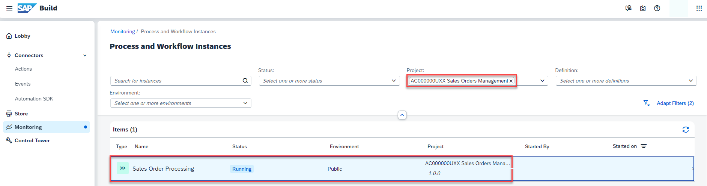
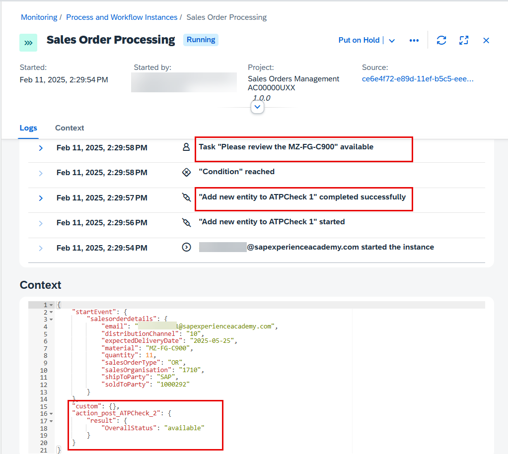
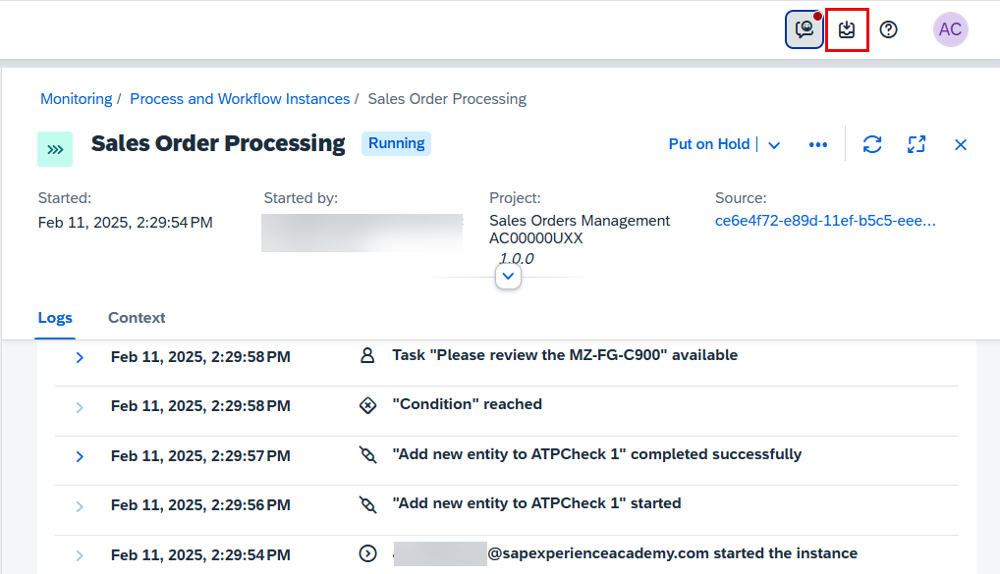

Monitoring business process is one of the key aspects of the automated processes. Technical monitoring is an administrator job where a process admin proactively and consistently monitors the process performance, identifies any issues in the process, and takes necessary actions to ensure business process continuity.

**SAP Build** provides different applications to monitor and manage different process artifacts. These applications are available under the **Monitor** tab.

1. To monitor all the running instances of the process, you must go to **Process and Workflow Instances** under the **Monitor** section.

   - There, you will see all the running, erroneous and suspended process instances. Use the filter bar to get a more customized view of the process instances based on different statuses like running, completed, suspended, terminated and so on.

2. Search for the project **Sales Orders Management {placeholder|userid}** using the Project drop down. All the instances of the selected project are displayed in the following table. Select the latest one as it was the one created in the previous lesson.

   > Explore different process monitoring options. Observe the process instance information, process context which is the actual process data flowing across different activities in the process and the execution logs where you can see entire trace of how the process has been progressing with some basic runtime information of each activity.

3. You can check the Logs and Context for this instance. The process passed the ATP (Available-to-Promise) check. This service validates whether a requested material is available in the specified quantity by analyzing inventory and supply data. 

   

4. As you can see the process is waiting for the task to be completed. These tasks are generated from the forms that are added in the process and can be accessed via the **My Inbox** application.

5. Select the icon on the top right corner to open the **My Inbox** application.

**Congratulations!**
You successfully completed this unit and are ready to create a Sales Order App using SAP Build Apps.