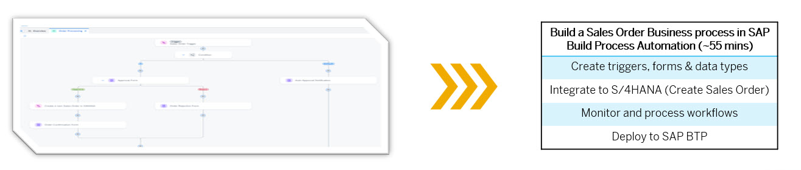

# Overview of Sales Order Process for SAP Build Process Automation

<!--With SAP Build Process Automation, create a sales order approval process that can be triggered with an API call, and then run it by sending the sales order details in the API call.-->

Sales orders are used to document and manage customer purchase requests, specifying the products or services to be delivered along with pricing and terms. Use SAP Build Process Automation to design a sales order approval process that can be initiated via an API call and executed by passing the sales order details within the request.

## Prerequisites

- You have cleared your browser cache
- Your **{placeholder|userid}** username and password
- You have access to the SAP Build Process Automation [Lobby]({link|buildlobby})

> **Note:** Make sure to follow the exercise documentation and use the provided naming conventions. Otherwise, you will encounter issues.

## Goal

You will learn

- How to create a SAP Build Process Automation project to build and extend business processes

## Further information

- [Product Page](https://www.sap.com/products/technology-platform/process-automation.html)
- [SAP Discovery Center - Services for SAP Build Process Automation](https://discovery-center.cloud.sap/viewServices?category=processautomation)
- [Developer Community for SAP Build Process Automation](https://community.sap.com/topics/process-automation)
- [SAP Builders Interest Group](https://groups.community.sap.com/t5/sap-builders/gh-p/builders)
